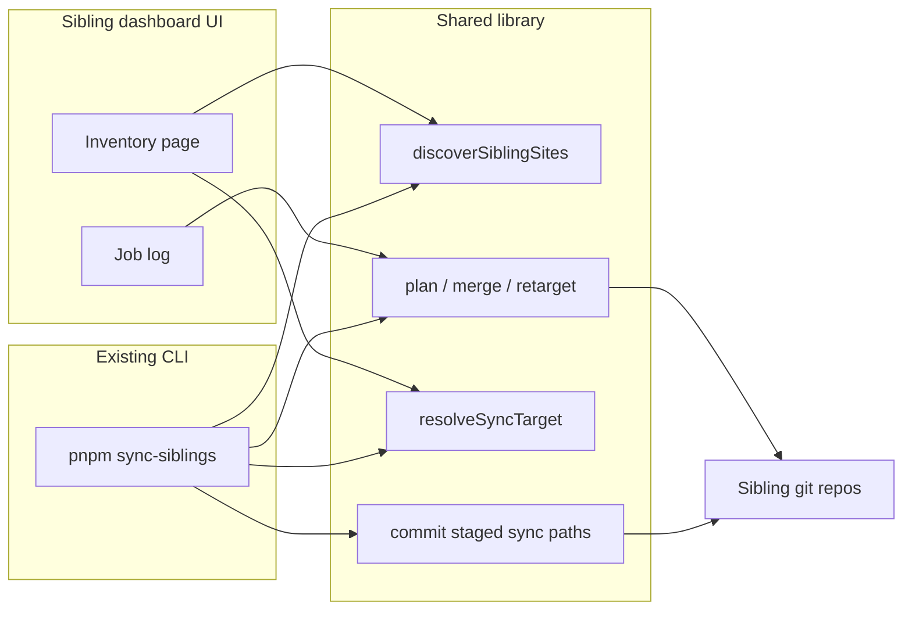

# Spec: FilePress sibling dashboard (local operator)

**Status:** locked — **M0–M2 implemented** (M2: 2026-08-25)  
**Date:** 2026-08-20  
**Phase:** 4-feature-iteration  
**Related:** [`scripts/sync-sibling-sites.ts`](../scripts/sync-sibling-sites.ts) · [EXTERNAL_SITES.md](./EXTERNAL_SITES.md) · [DEPLOY.md](./DEPLOY.md) · [LOCALSLIP.md](./LOCALSLIP.md)

**Surface:** localhost UI (`pnpm siblings`, default `http://127.0.0.1:5198`) plus CLI (`pnpm sync-siblings`). Shared library: `scripts/siblings/lib.ts`. Neither the UI nor `.filepress-siblings/` ships in the `getfilepress` npm tarball.

---

## 0. Locked decisions

| # | Topic | Proposal |
| --- | --- | --- |
| Q1 | Framing | **Local operator tool** for the person who maintains the engine and many content sites. Not a product feature, not on getfilepress.com, not in the published `files` list. |
| Q2 | Source of truth | **One library** used by CLI and UI. The dashboard does not reimplement pin rewrite, header merge, lockfile resolution, or git commit. It calls the same functions `sync-siblings` already uses. |
| Q3 | Discovery | **Walk sibling folders** next to the engine, plus in-repo `sites/*` that have `filepress.config.ts`. Optional **Scan folder** enrolls extra paths (LocalHelm-shaped: scan never writes; add confirms). Optional local ignore list. No hardcoded site roster. |
| Q4 | Bind | **127.0.0.1** by default. Optional `--host` for LAN, same caution as `filepress dev`. |
| Q5 | Git write | **Commit on apply** (stage only engine pin, lockfile, `static/_headers`). **Never push** unless a later milestone adds an explicit, confirmed Push action. |
| Q6 | Sync target | **Published npm `getfilepress` latest** when local engine version is ahead (unpublished bump). Local version wins only when it is on the registry or npm is unreachable (then say so). |
| Q7 | Jobs | **One mutating job at a time.** Sequential sites. Live log with the real command output and the real error. Failed site does not stop the rest unless the operator chose “stop on first error.” |
| Q8 | State | Last inventory + last job log under a **gitignored** engine-local dir (e.g. `.filepress-siblings/`). Sites stay the source of their own git history. |
| Q9 | Dev servers | **Out of v1.** Show LocalSlip lease/port if present; do not claim ports or spawn `filepress dev` until a later milestone. |
| Q10 | Name | **Sibling dashboard** in docs and UI. CLI stays `pnpm sync-siblings` for the headless path. |
| Q11 | Look | **LocalSlip chrome, LocalHelm operator affordances.** Parchment board (`#faf8f3`), black header/footer bands, one bordered table card with a sticky head, FilePress green `#0f5c4c` as the accent. Read vs write button groups, digest chips, badge tones, and an activity pane come from LocalHelm. No toasts; inline status lines only. |
| Q12 | Plan gate | **Apply and Ship stay disabled until Plan has run for exactly the current selection.** Changing the selection re-locks them. Auto-refresh does not. |
| Q13 | Inventory cost | **One subprocess per kind, per pass.** `localslip ls` once (never `localslip get` per site), `git status` in parallel across repos, cached server-side. Inventory must stay under ~1s for a 15-site workspace. |

Locked 2026-08-20. M0 library + M1 dashboard are in-repo.

---

## 1. Problem / why this exists

The house keeps many **content-only FilePress sites** as sibling folders next to the engine. The recurring job is the same every engine release:

1. See which sites exist and how they pin `getfilepress`.
2. Move `link:` / stale locks onto the published engine.
3. Merge default security headers when a site already has `static/_headers`.
4. Commit those files in each repo.
5. Optionally `pnpm ship` to Pages.

A CLI (`pnpm sync-siblings`) now does that. It is easy to mistime: apply before publish, apply after an unpublished local bump, or apply without committing. The log is a long scroll; there is no single place that answers “what is this site on, is git dirty, can it ship?”

The dashboard is a **read-mostly inventory** plus **buttons that run the same jobs** with a visible plan, a live log, and a per-site result. It does not become a CMS.

### Thesis

| Keep | Add |
| --- | --- |
| CLI as the operator escape hatch | A localhost table of every discovered site |
| Deterministic sync (code owns pins, headers, git paths) | Plan → confirm → log, instead of “run and hope” |
| Sites as separate git repos | One screen for pin, lock, headers, ship, dirty |
| No push unless the human means it | Explicit later Push, never implied by Sync |

---

## 2. Non-goals

- **Not published.** No `filepress dashboard` bin on npm. No Pages deploy of this UI.
- **Not a remote fleet manager.** No agents, no SSH, no Cloudflare API token store in v1 (Wrangler uses the operator’s existing login when Ship runs).
- **Not a content editor.** No posts, pages, Genie, or theme editing.
- **Not a monorepo.** It does not merge sibling repos. It does not `git submodule` them.
- **Not Site A building Site B** except when the operator starts a job from this tool (the engine’s isolation rule still holds for normal `filepress build`).
- **No LLM** choosing commits, pins, or header text.
- **No auto-push, no `--force`, no rewriting unrelated dirty files.**
- **v1 does not start/stop dev servers** or open firewall ports.

---

## 3. Discovery (same as the CLI)

Workspace root = parent of the engine checkout. A site is listed from **one** of:

1. **Siblings** — each immediate child of the workspace (skip the engine folder, `node_modules`, dot-dirs, `__*`). Keep it if `package.json` or `site/package.json` depends on `getfilepress` **and** a `filepress.config.ts` exists.
2. **In-repo** — each `sites/<name>/` under the engine that has `filepress.config.ts` (no own `package.json` required). Pin kind is `engine`; Sync does not rewrite the engine package. Ship only when the engine `ship` / `build:www` script names that site.
3. **Enrolled extras** — paths in gitignored `.filepress-siblings/extras.json`, added from **Scan folder**. Scan walks a chosen root (default workspace, depth 3, skip `node_modules` / `build` / `.git`). It never writes. Add persists the ticked new paths.

Deduplicate by content root. Optional ignore list (folder names) still hides rows.

A site record is derived, not configured:

| Field | Meaning |
| --- | --- |
| Folder name | Sibling directory name (display id) |
| Repo root / package dir / content root | Where git, the dep, and Markdown live |
| Pin + kind | npm caret, `link:` / `file:` / `workspace:`, or git URL |
| Locked version | Importer line in the **workspace** lockfile when a parent `pnpm-workspace.yaml` exists; otherwise the nearest lockfile. Never the first `getfilepress@` leftover in a nested lock. |
| Headers | Missing (engine will emit at build) / has `static/_headers` already complete / merge would add named rules |
| Ship | `pnpm ship` cwd if a `ship` script exists on the site package or repo root |
| Config `url` | Live origin from `filepress.config.ts` when it can be read without executing user code unsafely — prefer a small TS parse or cached last-known; do not eval arbitrary config in the UI process if that is hard. Fallback: “url unread.” |
| Git | Dirty? Ahead/behind origin? (read-only in v1) |
| Lease | LocalSlip port, matched from one `localslip ls` table by package name, content folder, or sibling folder name |

Optional **ignore list** (engine-local JSON): folder names never shown and never mutated. The default list is empty. The spec does not name sites.

---

## 4. What the operator sees

One page. A table (or card list) of discovered sites. A header strip for the engine.

### 4.1 Engine strip

- Local engine version (`package.json`).
- npm `getfilepress` latest (fetched; show age / error if the registry is down).
- **Sync target** (Q6): the version apply/ship will actually install.
- Last job: time, mode (dry-run / apply / ship), counts (ok / failed / skipped).

If local > npm: banner *“Local N is not on npm. Jobs will use M.”*

### 4.2 Site row

| Column | Content |
| --- | --- |
| Site | Folder name; link to content root on disk |
| Pin | Kind + specifier; locked version vs sync target (behind / current / unknown) |
| Headers | none / ok / needs merge (which header names) |
| Ship | yes / no |
| Git | clean / dirty / no repo; ↑N ahead / ↓N behind origin when an upstream exists |
| Live | `url` if known (external link) |
| Dev | LocalSlip port if known, linked to `http://127.0.0.1:<port>` (no start button in v1) |

Row actions: **Plan**, **Apply**, **Ship** (hidden or disabled if no ship script). Selection checkboxes for bulk.

### 4.3 Plan panel

Before any mutate, show the same plan the CLI already prints, as structured rows:

- update: skip / already / rewrite `link:` → `^target` / `pnpm update`
- headers: none / ok / merge (+ names)
- commit: which paths, or skip
- ship: command + cwd, or none

Confirm is required for Apply and Ship. Dry-run / Plan does not write.

### 4.4 Job log

A sliding panel or bottom drawer:

- Command lines as run (`pnpm update`, `git commit`, `pnpm ship`).
- Full stdout/stderr (anti-pattern: never “failed” without the error).
- Per-site status that updates as the queue advances.
- Copy log / open log file.

---

## 5. Actions

All mutating actions are **jobs**. The UI never silently writes a repo.

### 5.1 v1 (must)

| Action | Writes | Notes |
| --- | --- | --- |
| Refresh | No | Rediscover + re-read pins, locks, headers, git porcelain |
| Plan (dry-run) | No | Same as `pnpm sync-siblings` / `--only …` |
| Apply | Yes | Pin rewrite, `pnpm update`/`install`, header merge, **commit** (Q5). No push. |
| Ship | Yes | Apply, then `pnpm ship` in the site’s ship cwd |
| Apply without commit | Yes | Same as `--no-commit` |
| Open folder | No | OS file manager at content root |

Bulk Apply / Ship uses the current selection, or all rows if none selected (confirm copy must say which).

### 5.2 Later (not v1)

| Action | Why later |
| --- | --- |
| Push selected remotes | Easy to regret; needs an extra confirm and “ahead” check |
| Live header probe | `curl -sI` on `url` for HSTS / CSP / no `ACAO: *` — useful after ship |
| Start/stop `filepress dev` | LocalSlip claim vs read, firewall, leftover Vite processes |
| Hide / ignore folder | Needs the ignore file UX |
| Create site | Already `create-site --external`; wire later |
| Publish engine | Stays `pnpm publish` in the engine repo, not this UI |

---

## 6. How it works (architecture)

### 6.1 Extract first

Before any UI: move the logic in `scripts/sync-sibling-sites.ts` into a small module (still not published) that exports:

- `discoverSiblingSites`
- `resolveSyncTarget` / published version fetch
- `parseLockedGetfilepress` / `resolveLockfileDir`
- `retargetGetfilepressToNpm` / `mergeSecurityHeaders` (headers stay in `@filepress/core`)
- `planSite` / `applySite` / `commitSite` / `shipSite`

The CLI becomes a thin wrapper. The dashboard process imports the same module (via `tsx` or a tiny local server).

### 6.2 UI process

Proposed: a **local HTTP server** in the engine repo (Node, 127.0.0.1, LocalSlip lease when we add one).

- `GET /api/inventory` — discovery + status (JSON matching the TypeScript types; no schema drift). Served from a short-lived cache; `?refresh=1` forces a rebuild. Concurrent callers share one in-flight build, and the cache is warmed at listen time so the first paint is free.
- `POST /api/jobs` — `{ action, only[], commit, stopOnError }` → job id.
- `GET /api/jobs/:id` — status + log tail (or SSE).

The page is a simple Svelte (or even static HTML + fetch) app. It does not need SvelteKit, adapter-static, or Genie.

Jobs run in-process or as a child `tsx` of the same library. Do not shell out to a second copy of the logic.

### 6.3 Git rules (normative)

When committing after apply:

- `git add` only: that site’s `package.json`, the **resolved** lockfile, and `static/_headers` if present.
- Message: `Sync getfilepress to <target>.` plus a short body about pin + headers.
- No attribution trailers.
- If those paths have no diff: “nothing to commit,” still success.
- If the folder is not a git repo: skip commit, say so, do not fail the site unless the operator required a commit.

### 6.4 Inventory budget (normative)

Discovery reads files; everything else is a subprocess, so subprocesses are the budget.

- **Never one subprocess per site for the same fact.** `localslip get <name>` per site cost ~8s on a 15-site workspace; one `localslip ls` plus in-process name matching costs ~0.5s and is cached for 30s.
- `git status --porcelain` runs in parallel (bounded concurrency), not in a loop.
- The npm registry fetch, the lease table, and the git sweep all overlap.
- A slow or failing helper degrades one column; it never blanks the board or permanently disables itself. Only a spawn failure (binary not on PATH) turns a lookup off for the process lifetime.
- Plans and the CLI dry-run skip lease/git lookups entirely — they do not print them.

### 6.5 Safety rails

- Sync target from npm when local is unpublished (already CLI behavior after 2026-08-20).
- After `pnpm update`, re-read the **importer** version; fail that site if it is not the target (do not ship a known-old engine).
- Prefer workspace lockfile over a leftover `site/pnpm-lock.yaml`.
- One job at a time; disable Apply/Ship while a job runs.
- Bind 127.0.0.1; no auth in v1 because it is loopback-only. LAN bind is opt-in and warned.

---

## 7. Error handling (normative)

Every failed site in the UI must show:

1. Which step failed (update / headers / commit / ship).
2. The **exit code and stderr** (or thrown message).
3. A one-line hint when we already know the class of bug (unpublished engine, wrong lockfile, no ship script).

Never a count-only failure (“1 failed”) without a way to open that site’s log.

---

## 8. Milestones

### M0 — Library (no UI)

- Extract shared module; CLI behavior unchanged (including tests).
- Inventory JSON type documented next to the module.

**Exit:** `pnpm sync-siblings` still works; unit tests still cover pin rewrite, lock parse, sync target, header merge. **Done.**

### M1 — Dashboard v1

- Local server + inventory table + engine strip.
- Plan / Apply / Ship / `--no-commit` equivalent.
- Job log with real output.
- Commit after apply (Q5).

**Exit:** Operator can refresh, plan, apply a subset, see a commit in that repo, without using the CLI. CLI remains available. **Done** (`pnpm siblings` → `http://127.0.0.1:5198`).

### M1.5 — House style and speed

- LocalSlip chrome + LocalHelm operator affordances (Q11), plan gate (Q12), skeleton / empty / error states, 10s idle polling that pauses during a job.
- Inventory budget met (Q13): ~9s → ~0.5s on a 15-site workspace.

**Exit:** Board paints on load, ports and git state resolve for every row, and a poll never rebuilds the table under the cursor. **Done.**

### M2 — Status depth

- Ahead-behind vs origin on the row (dirty and `url` landed in M1.5). Parsed from the same `git status --porcelain -b` already used for dirty — no extra spawn per site.

**Exit:** Every git repo shows ↑N / ↓N / synced next to dirty/clean. **Done.**

- Optional live `HEAD` check after ship (HSTS, CSP, no `access-control-allow-origin: *`) — still later.

### M3 — Dev and ignore

- Optional start/stop `filepress dev` (read lease, do not claim in the build job).
- Ignore list editor.

---

## 9. Testing

- Keep today’s unit tests on the library (do not only click the UI).
- Add a fake workspace fixture (temp dirs, one npm pin, one `link:`, one leftover nested lockfile, one pages-only `_headers`) and assert inventory + plan. No live sibling names in fixtures.
- Manual happy path: Plan → Apply one fixture repo → commit exists → `git show` only lists the allowed paths.

---

## 10. Open questions

Answer these when locking §0:

1. **M1 bind port** — fixed LocalSlip lease vs ephemeral vs `FILEPRESS_YARD_PORT`?
2. **Push in M2 or never?** Default proposal: never in this UI unless you ask for it later.
3. **Should Apply to “already current” still commit leftover dirty sync files?** Proposal: **yes** (that is how we backfill a commit-less apply).
4. **Ship confirm** — extra checkbox “I know this deploys Pages” vs one Confirm?
5. **Read `filepress.config.ts`** — `tsx` import vs regex `url:`? Import is accurate; regex is safer. Prefer a dedicated export or a tiny JSON sidecar later; v1 may show folder + pin only if import is messy.

---

## 11. What success looks like

After an engine publish, the operator opens the dashboard, sees every discovered sibling, sees who is behind the sync target or missing header rules, selects them, confirms Apply, watches the log, and each repo has a commit. Ship is a second, obvious step. The CLI still does the same job in CI or a terminal. Nothing in this system ships to production except the static sites the operator chose to ship.
